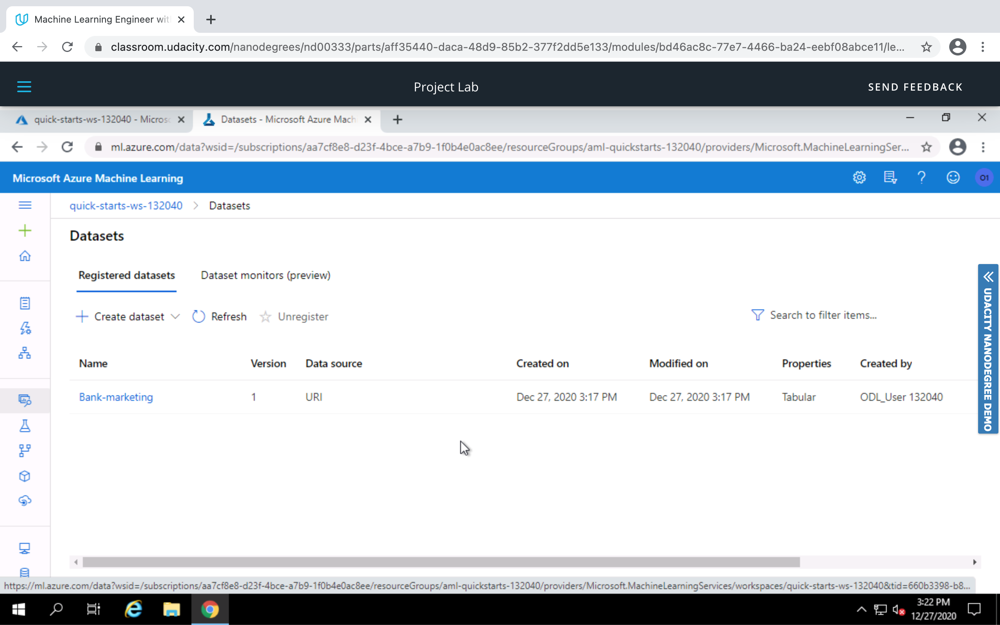
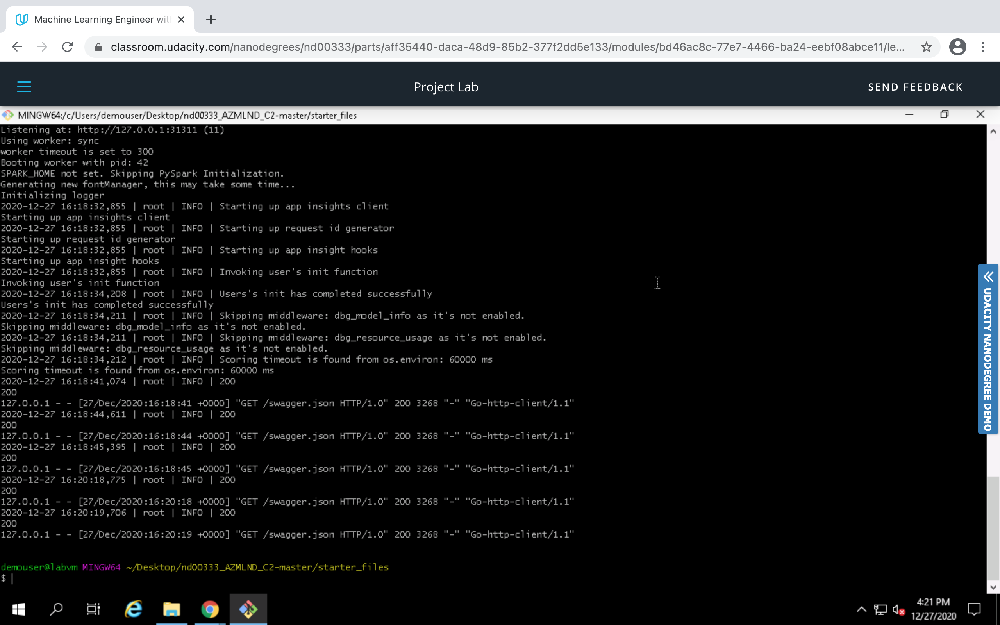

## Operationalizing Machine Learning

We create an Automated Machine Learning pipeline in Azure Machine Learning Studio. On successful execution of Automated ML, we get to see the best model that provides the highest accuracy for the given dataset. However, the model has been deployed with authentication and application insights (logging)enabled which in turn provides an HTTP REST API endpoint. Swagger helps for API documentation, and Apache Benchmark helps in measuring performance of the deployed model. This project also extends to create, publish and consume a pipeline. 

The data contains different attribute of banking clients. The classification goal is to predict if the client will subscribe a term deposit (variable y).

Data Shape: 32,950 (row) x 20 (column)

The data is available at this [link](https://automlsamplenotebookdata.blob.core.windows.net/automl-sample-notebook-data/bankmarketing_train.csv).

## Architectural Diagram

The following diagram shows the architecture of the project. 

Step 1: The given dataset is registered in ML Studio. 
Step 2: We have created a compute cluster with minimum node 1 and maximum node 7 of type Standard_DS12_v2 VM.
Step 3: An Automated ML experiment is created to solve a classification problem. 
Step 4: The experiment is executed.
Step 5: Once the experiment is complete, it finds out the best model for deployment. 
Step 6: Swagger helps with API documentation. 
Step 7: The endpoint i.e. HTTP REST API is however consumed with a python script. 
Step 8: Apache Benchmark performs a load testing in the deployed model. 

## Key Steps

This screenshot shows the availability of the dataset in the studio.

The following picture highlights status of Automated ML experiment. 

It turns out that Voting Ensemble is the best model with accuracy  0.92018.

Upon successful run of Automated ML, the best model has been deployed, and deployment state shows healthy. 

By running logs.py, we enabled Application Insights which provides an URL. 

The following screenshots show the log as a result of runnig logs.py

Swagger helps interact with the endpoint. 

With help of endpoint.py, we are able to consume the endpoint. 

Apache Benchmark shows result of performance metrics.

We have created a new pipeline using aml-pipelines-with-automated-machine-learning-step.ipynb. The following screenshot depicts the same. 

Once the pipeline is excuted, an endpoint is created. 

Pipeline overview shows HTTP REST API as the endpoint. 

The below designer graph highlights association of dataset i.e. Bank-marketing with AutoML module. 

Jupyter widget shows completion of step runs. 

The scheduled run of the pipeline is shown in the picture. 

## Screen Recording
Screencast is available [here](https://youtu.be/dYZGjbWXmD8).

## Standout Suggestions
1. We need to think of a large dataset and to work on imbalanced dataset in order to get unbiased result. 
